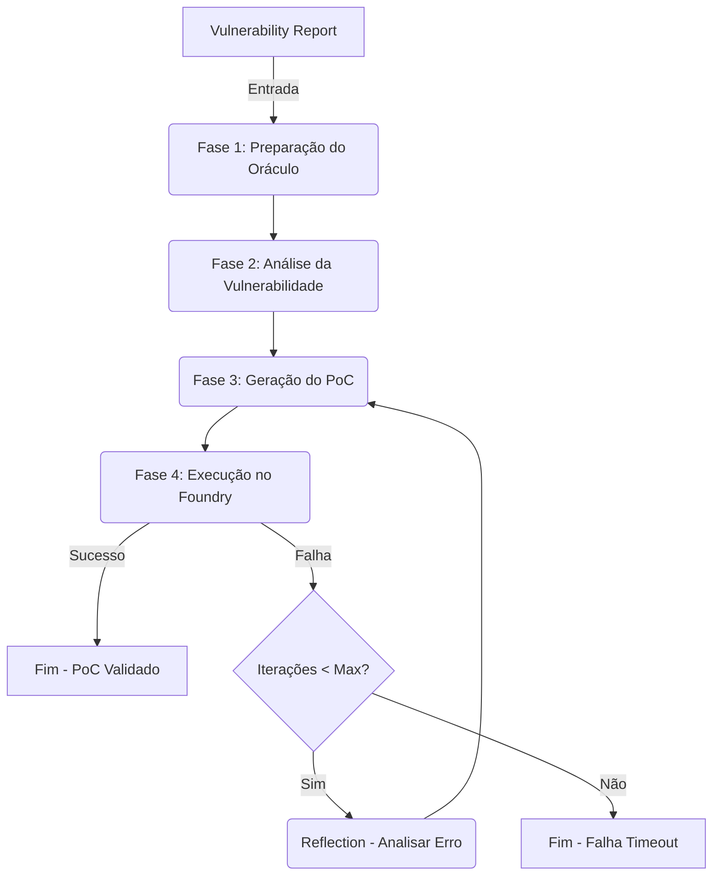

# Agente Gerador de PoCs (Tester) - Definição do Projeto

Este documento detalha a arquitetura e o fluxo de funcionamento do **Agente Gerador de PoCs (Tester)**, seguindo a mesma estrutura de definição utilizada para o Agente Auditor.

---

## Diagrama do Tester

O Tester é implementado como um `StateGraph` (LangGraph) que recebe o relatório de vulnerabilidade e itera para gerar, compilar e validar um teste executável (Proof of Concept) usando o framework Foundry.

---

## Fase 1: Preparação do Oráculo (`oracleNode`)

O objetivo desta fase é preparar todo o contexto do repositório para garantir que o LLM tenha as informações corretas de importação e de estado antes de gerar código.

1. **Geração do Scaffold:** Cria a estrutura inicial do arquivo de teste (`Exploit.t.sol`), incluindo a função `setUp()` baseada no construtor do contrato alvo.
2. **Extração de Contexto do Projeto:** 
   - Lê o `remappings.txt` do projeto para resolver caminhos de bibliotecas (ex: `@openzeppelin/`).
   - Usa BFS (Breadth-First Search) para encontrar o arquivo `.t.sol` existente mais complexo e extrair seus `imports` como referência de padrão.
3. **Isolamento e Limpeza:** Remove testes nativos do projeto do diretório `test/` do Foundry para evitar conflitos de compilação quando bibliotecas não estão presentes.
4. **Criação de Stubs (Dependências Faltantes):** Executa um `forge build` rápido. Se pacotes externos (`node_modules`, `lib/caviar`) estiverem ausentes no ambiente, o agente gera contratos falsos (Stubs) com as interfaces mínimas necessárias para que a compilação prossiga.
5. **Análise de API (AST):** Gera a assinatura completa (funções, eventos, erros) do contrato alvo para guiar o LLM.

---

## Fase 2: Análise da Vulnerabilidade (`analyzeVulnerabilityNode`)

Esta fase interpreta o relatório do Auditor (e o código fonte) para traçar uma estratégia de ataque antes de escrever o teste.

1. **Recebe o Contexto:** Lê o `VulnerabilityReport` contendo:
   - Descrição da falha
   - Revisão do Juiz (explicação técnica do Auditor)
   - *Exploitable Paths* (passo-a-passo sugerido pelo Auditor)
   - Contexto geral do protocolo
   - Diferença de código da correção (*Patch Diff*, se executado via benchmark).
2. **Definição da Estratégia (LLM):** Pede ao LLM para responder 4 perguntas críticas:
   - Qual a causa raiz?
   - Quais as condições de ativação (precondições)?
   - Qual a sequência exata de chamadas para o exploit?
   - **Qual asserção (`assert`) provará a vulnerabilidade?** (Ex: *o saldo roubado deve ser maior que 0*, ou *a chamada deve reverter com X*).

---

## Fase 3: Geração do PoC (`generatePoCNode`)

É aqui que o código Solidity do exploit é efetivamente escrito. Esta fase adapta o prompt dependendo do estado atual do loop de reflexão.

1. **Modo `INITIAL`:** (Primeira tentativa) Gera o código usando o Scaffold do oráculo e a estratégia traçada.
2. **Modo `FIX_COMPILE`:** (Se falhou ao compilar) Recebe o erro exato do compilador (linha e arquivo). É instruído a verificar imports e tipos.
3. **Modo `MINIMAL_INTERFACE`:** (Escape Hatch) **Se a compilação falhar 3 vezes seguidas**, o agente abandona os imports de repositório e injeta interfaces cruas (ex: `interface IERC20 { ... }`) direto no arquivo de teste. Isso salva execuções que falhariam por dependências quebradas.
4. **Modo `FIX_LOGIC`:** (Se compilou, mas o teste reverteu) É instruído a verificar a ordem das chamadas, permissões (`vm.prank`), saldo de setup (`vm.deal`) e analisar os *traces* do EVM. Contém padrões prontos para erros clássicos (ex: *Reentrancy callback*, *Unchecked return values*).

---

## Fase 4: Execução no Foundry (`runFoundryNode` & `reflectNode`)

1. **Sanitização do Código:** Extrai o código Solidity do output do LLM. Valida se o contrato se chama `ExploitTest` e a função principal é `test_Exploit()`.
2. **Execução Isolada:** Roda o teste dentro de um container/diretório temporário (`customSandboxDir`) usando o comando `forge test`.
3. **Análise de Logs (`logAnalyzer`):** 
   - Parseia a saída bruta do Forge.
   - Categoriza o erro em: `COMPILER_ERROR`, `ASSERTION_FAILED`, `REVERT_NO_MESSAGE`, `SETUP_FAILED`, etc.
   - Extrai as linhas cruciais do erro (ex: `Error (6275): Source "src/Token.sol" not found`).
4. **Decisão:**
   - **Passou:** Retorna sucesso e o código final.
   - **Falhou:** Envia o log sumarizado de volta para a Fase 3 (via `reflectNode`) iterando até o `MAX_ITERATIONS` (atualmente 6).

---

## Resultados (Avaliação do Benchmark PoCo)

Para avaliar a resiliência do agente e comprovar a arquitetura, ele foi testado contra o dataset público **ASSERT-KTH/Proof-of-Patch** (22 vulnerabilidades reais auditadas, com correções validadas).

**Métricas:**
* **Reproducibility Rate (Taxa de Reprodução):** Capacidade do agente compilar e rodar um PoC que passe na versão vulnerável.
* **Specificity Rate (Taxa de Especificidade):** Garantia de que o teste criado *falha* quando executado contra o código já corrigido (prova de que a asserção mirou no bug real, e não em falsos positivos genéricos).

**Progressão de Resultados:**
1. **Baseline (Sem Oráculo e sem Reflection inteligente):** ~27% de reprodução (falhas massivas de compilação por imports errados).
2. **Com Oráculo (Remappings + BFS + Stubs):** As falhas de compilação caíram drasticamente.
3. **Com `MINIMAL_INTERFACE` e Prompts Refinados:** Atingiu **54.5%** de reprodução em projetos do mundo real, comprovando a eficácia da adaptação dinâmica do agente perante falhas repetidas.
