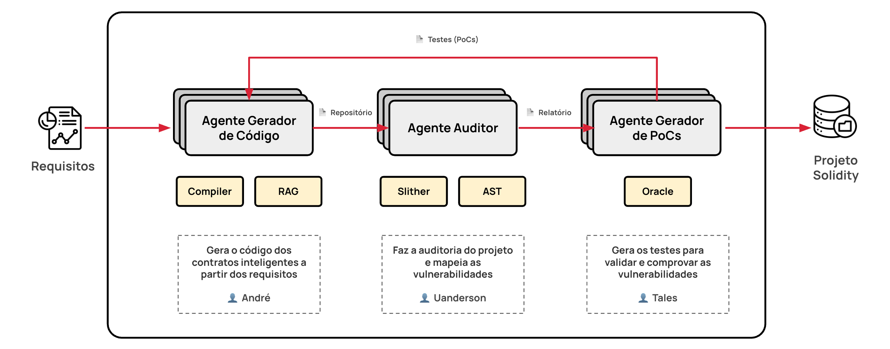

# Projeto de TALP1

Projeto desenvolvido para a disciplina **IN1045 — Tópicos Avançados em Linguagens de Programação 1 (TALP1)**, do curso de Mestrado em Ciência da Computação do **Centro de Informática da Universidade Federal de Pernambuco (CIn-UFPE)**.

## Live Version - Hugging Faces

O projeto está disponível para ser testado em: 

[Multi Agent Smart Contracts](https://huggingface.co/spaces/TALP-Project/multi-agent-smart-contracts)

A entrada esperada deve ser um requisito onde a solução é um smart contract, o sistema multi agente irá ter como resultado final o código solidity com a solução proposta após passar pelos 3 agentes

## Visão Geral

Este projeto tem como objetivo desenvolver um sistema multiagente inteligente para **geração**, **auditoria** e **validação de vulnerabilidades** em *smart contracts*.

A proposta é receber documentos contendo requisitos, especificações e descrições funcionais do sistema, processar essas informações e utilizá-las para:

* gerar contratos inteligentes automaticamente;
* identificar potenciais vulnerabilidades de segurança;
* criar provas de conceito (*Proofs of Concept — PoCs*) para validar as falhas encontradas;
* executar um ciclo iterativo de refinamento e melhoria contínua.

O sistema é implementado em **TypeScript** e **Node.js**, utilizando a biblioteca **LangGraph** para orquestração dos agentes inteligentes e definição dos fluxos de execução.

## Arquitetura Geral

O sistema é composto por agentes especializados que colaboram entre si em diferentes etapas do processo:

1. **Exploração e análise dos requisitos**

   * Processamento e compreensão dos documentos fornecidos;
   * Extração de contexto técnico e requisitos relevantes.

2. **Geração de Smart Contracts**

   * Criação automática de contratos inteligentes com base nas especificações extraídas.

3. **Auditoria de Segurança**

   * Análise estática e contextual do código gerado;
   * Identificação de vulnerabilidades e comportamentos inseguros.

4. **Geração de PoCs**

   * Construção automática de provas de conceito para validar as vulnerabilidades detectadas.

5. **Refinamento Iterativo**

   * Uso do feedback da auditoria e das PoCs para aprimorar o código gerado.

## Agentes

### Gerador de Código

Responsável por gerar *smart contracts* a partir dos requisitos e especificações fornecidos.

### Auditor de Smart Contracts

Responsável por analisar o código gerado em busca de vulnerabilidades, inconsistências e problemas de segurança.

### Gerador de PoCs

Responsável por criar provas de conceito capazes de validar e demonstrar as vulnerabilidades identificadas durante a auditoria.

## Tecnologias Utilizadas

* TypeScript
* Node.js
* LangGraph

## Equipe

* André Souza — [alssg@cin.ufpe.br](mailto:alssg@cin.ufpe.br)
* Uanderson Ricardo Ferreira da Silva — [urfs@cin.ufpe.br](mailto:urfs@cin.ufpe.br)
* Tales Vinicius Alves da Cunha — [tvac@cin.ufpe.br](mailto:tvac@cin.ufpe.br)
