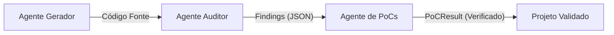

# Agente Gerador de PoCs (Tester)

Este agente é responsável por validar vulnerabilidades identificadas pelo **Agente Auditor** através da geração automática de exploits em Solidity (*Proof of Concepts* - PoCs) e execução em um ambiente sandbox utilizando **Foundry**.

## 1. Visão Geral

O agente implementa um **loop ReAct** (Gerar → Executar → Refletir) orquestrado via **LangGraph**. Diferente de abordagens tradicionais, ele utiliza um componente **Oracle** para preparar o scaffold do teste, permitindo que o LLM foque exclusivamente na lógica do exploit.

### Fluxo Multi-agente


### Principais Funcionalidades:
- **Sandbox Autônomo:** O agente detecta e inicializa o ambiente Foundry (`/tmp/poc-sandbox`) automaticamente no primeiro uso.
- **Scaffold Automático:** Gera o arquivo `Exploit.t.sol` com o contrato vítima já instanciado e financiado.
- **Loop de Auto-correção:** Se o exploit falhar, o agente analisa os logs e tenta corrigir o código por até 5 iterações.
- **Integração com DeepSeek:** Utiliza o modelo `deepseek-v4-pro` via OpenRouter.

## 2. Arquitetura

O fluxo de execução segue o grafo definido em `agent.ts`:

1.  **Oracle Node:** Recebe o relatório de vulnerabilidade e gera o scaffold Solidity inicial.
2.  **Generate PoC Node:** O LLM completa a função `test_Exploit()` com base no scaffold e na descrição da falha.
3.  **Run Foundry Node:** Escreve o código no sandbox e executa `forge test`.
4.  **Reflect Node:** Em caso de falha, analisa o output do Forge, classifica o erro e fornece feedback para o próximo ciclo de geração.

## 3. Estrutura de Arquivos

```
src/agents/tester/
├── agent.ts           # Definição do grafo LangGraph e lógica dos nodes
├── state.ts           # Estado interno do agente (PoCStateAnnotation)
├── types.ts           # Interfaces de entrada (Finding) e saída (PoCResult)
├── index.ts           # Entry point público (runPoCGenerator)
│
├── tools/
│   ├── scaffoldGenerator.ts  # Gerador de boilerplate Foundry
│   └── foundryRunner.ts      # Executor de comandos shell (forge)
│
├── prompts/
│   └── system.ts             # Instruções especializadas para o LLM
│
└── utils/
    ├── extractSolidity.ts    # Parser de blocos de código
    └── logAnalyzer.ts        # Classificador de erros de execução
```

## 4. Integração e Uso

### Fluxo de Dados (Input/Output)

O agente recebe um objeto `VulnerabilityReport`. Como o **Agente Auditor** gera objetos do tipo `Finding`, é necessário realizar um mapeamento (veja `src/index.ts` para o adapter).

#### Estrutura de Entrada (`VulnerabilityReport`)
```typescript
interface VulnerabilityReport {
  id: string;               // Identificador único do report
  severity: string;         // "high", "medium", "low"
  title: string;            // Título curto da falha
  description: string;      // Descrição técnica detalhada
  affectedContract: {
    name: string;           // Nome da classe do contrato
    sourceCode: string;     // Código-fonte completo (Solidity)
  };
  attackVector: string;     // Descrição do caminho de ataque
  exploitablePaths?: string[]; // (Opcional) Passos detalhados
}
```

#### Estrutura de Saída (`PoCResult`)
```typescript
interface PoCResult {
  reportId: string;
  status: "success" | "failed" | "timeout";
  solidityCode: string;    // Conteúdo final do Exploit.t.sol
  executionLogs: string[]; // Logs brutos de todas as iterações
  iterations: number;      // Total de tentativas realizadas
}
```

### Exemplo de Integração
```typescript
import { runPoCGenerator } from "./src/agents/tester";

// O orquestrador mapeia o Finding + Código Fonte para o Report
const result = await runPoCGenerator(report);
```

### Pré-requisitos
- **Foundry:** `forge` deve estar instalado e acessível. O agente busca em `~/.foundry/bin` e no PATH padrão.
- **API Key:** `OPENROUTER_API_KEY` deve estar configurada no arquivo `.env`.

## 5. Avaliação de Resultados

O `PoCResult` retorna um status que indica a validade da vulnerabilidade ou a eficácia de um patch:

| Status | Significado | Ação Recomendada |
| :--- | :--- | :--- |
| **`success`** | Exploit executou e passou na assertion. | Vulnerabilidade confirmada. |
| **`failed`** | Exploit falhou após 5 tentativas. | Verificar `executionLogs` para erro de lógica ou compilação. |
| **`timeout`** | Forge excedeu 60 segundos. | Possível loop infinito no contrato ou exploit. |

## 6. Base Acadêmica
A implementação deste agente foi inspirada no framework **PoCo** (Bergman et al., KTH 2025), adaptada para execução local determinística e suporte multi-agente.
